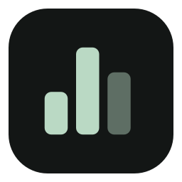
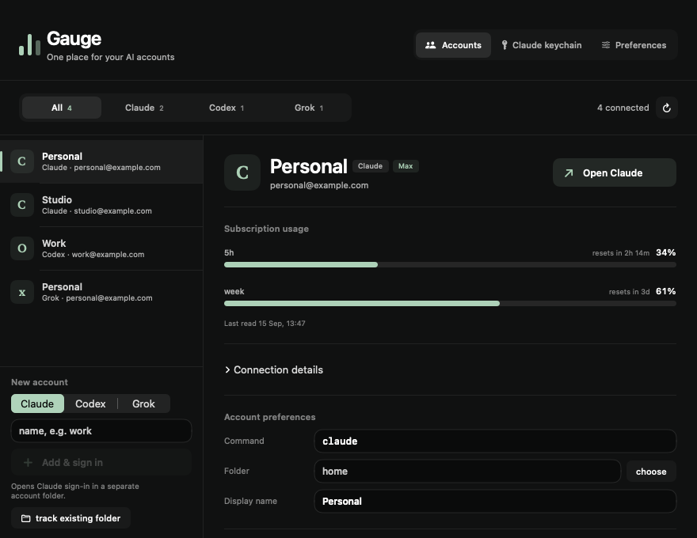

<p align="center">
  
</p>

<h1 align="center">Gauge</h1>
<p align="center">Claude, Codex, and Grok subscription usage in your Mac menu bar.</p>

## What Gauge does

- Shows usage windows, percentages used, and available reset times per account.
- Filters accounts by provider, with independent sign-ins and configuration folders.
- Opens an account in your preferred terminal; ⌘1–⌘9 open the visible accounts.
- Checks usage in the background and alerts when limits cross your chosen threshold.
- Keeps Claude session resume, shared-quota notices, and confirmed keychain cleanup.

The interface uses a neutral meter icon, provider labels, readable usage bars,
and an account manager with connection details tucked away until you need them.



*Interface preview with synthetic accounts.*

## Build and run

Requires **macOS 14+** and Swift from Xcode or Command Line Tools.
There is no Xcode project, Swift package, or external Swift dependency.

```sh
git clone https://github.com/pratikaman/ClaudeSwitch.git
cd ClaudeSwitch
./build.sh
open build/Gauge.app
```

Look for the usage meter in the menu bar. Gauge has no Dock icon and does not
open a window on startup. To install into `~/Applications`, run
`./build.sh --install`. Builds are ad-hoc signed; if macOS asks, right-click
Gauge in Finder and choose **Open**.

The app is now named Gauge; the repository URL remains ClaudeSwitch.

## Connect accounts

Open **Manage accounts → Accounts**, select Claude, Codex, or Grok in the new
account form, enter a name, and choose **Add & sign in**. Use **track existing
folder** to connect a configuration folder elsewhere on disk. Refresh after
signing in. Each account needs its own folder.

| Provider | Discovered folders | Usage source |
|---|---|---|
| Claude | `~/.claude`, `~/.claude-*` | Claude Code OAuth usage |
| Codex | `~/.codex`, `~/.codex-*`, `CODEX_HOME` | Codex CLI account rate limits |
| Grok | `~/.grok`, `~/.grok-*`, `GROK_HOME` | Grok Build subscription billing |

### Codex

Install [Codex CLI](https://developers.openai.com/codex/cli) and sign in with
ChatGPT. Gauge reads the windows returned by
[`account/rateLimits/read`](https://learn.chatgpt.com/docs/app-server), including
five-hour, weekly, and additional model-specific limits when available.
API-key sign-ins do not expose ChatGPT subscription limits.

### Grok subscriptions — experimental

Install [Grok Build](https://docs.x.ai/build/overview) and run `grok login` with
the account linked to your grok.com or X subscription. Gauge uses the CLI's ACP
billing extension, also used by its `/usage` screen. The methods were checked
against Grok Build **1.0.30**; a signed-in billing response still needs live
verification. This vendor extension can change between CLI releases.

Gauge displays Grok's reported subscription percentage. Missing or unrecognized
data produces an unavailable message, never a fabricated zero. Browser logins
are not imported, and xAI API spend is not included. The account manager also
links to [Grok's Usage page](https://grok.com/?_s=usage).

## Account isolation and stored data

Claude launches use `CLAUDE_CONFIG_DIR`; Codex uses `CODEX_HOME`; Grok uses
`GROK_HOME`. Default accounts clear their override, and Codex/Grok subscription
launches clear API-key overrides. Their CLIs own authentication and refresh;
Gauge never copies their tokens. Hiding a Codex or Grok account preserves its
files and sign-in. Select its folder again to restore it.

| Path under `~/Library/Application Support/Gauge/` | Contents |
|---|---|
| `config.json` | Preferences, account paths, names, and overrides |
| `usage-cache.json` | Last successful Claude usage readings |
| `launch/*.command` | Generated terminal launch scripts |

Codex and Grok readings are cached in memory. Connection failures retain the
last successful reading where available, mark it with its timestamp, and do
not generate threshold-crossing alerts. Tokens never enter Gauge's usage cache.

**Upgrading from ClaudeSwitch:** Gauge reads existing preferences and the
Claude usage cache from `~/Library/Application Support/ClaudeSwitch/` when the
corresponding Gauge file does not exist. Future saves go to Gauge's folder;
legacy files are preserved. Quit the old app to avoid duplicate polling.

## Development and verification

```sh
./build.sh                                  # compile, generate icon, and sign
./test.sh                                   # offline tests
build/tests/ProviderTests --render           # synthetic UI previews
build/tests/ProviderTests --live-codex       # optional real Codex usage check
```

Offline tests cover preference migration, discovery, provider isolation,
response parsing, missing data, RPC handshakes, timeouts, and sanitized errors.
They use synthetic accounts and local CLI fixtures. The optional live check
prints sign-in status and window count without identity or tokens.

`Sources/` contains the SwiftUI views, application state, and provider clients.
`tools/icon.swift` renders the new icon without external libraries. `build/`
contains generated artifacts and is ignored by Git. Legacy artwork remains in
`Resources/` but is no longer bundled.

MIT licensed.
